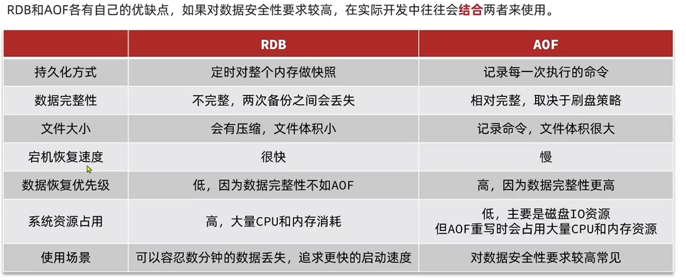
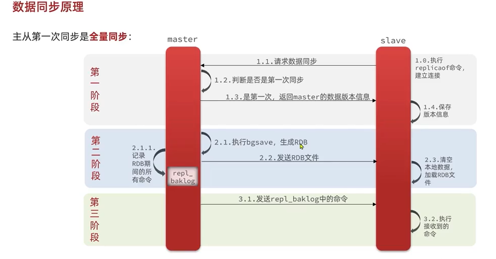
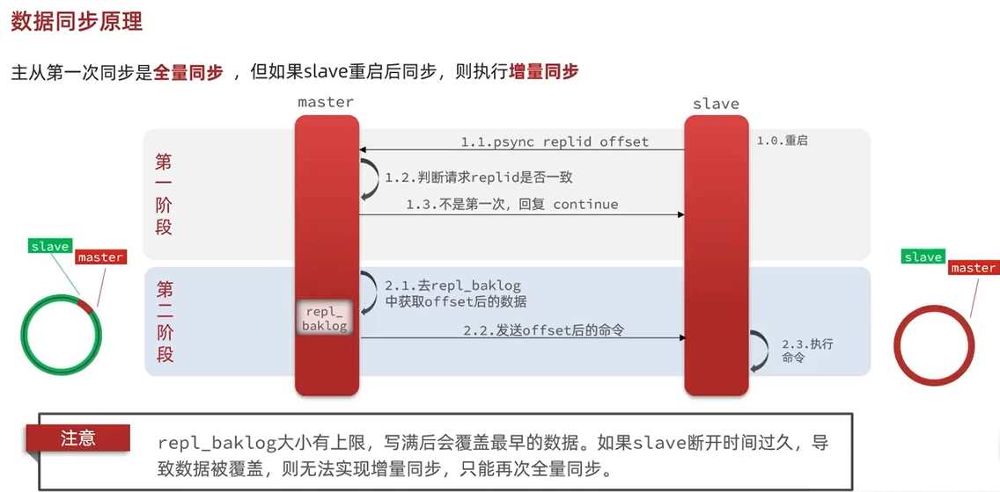

# RDB

## 概述

redis数据备份文件，也叫redis数据快照，将某一刻所有的内存数据都记录到内存中

redis故障重启后，从磁盘中读取快照文件，恢复数据。

## 命令

save：主进程程来执行备份，会阻塞所有命令

bgsave：后台进程程来执行，避免主线程收影响

- 流程 fork 子进程，与主进程共享物理内存空间，读取内存数据写入RDB文件
- fork采用 copy-on-write：主进程读操作，直接访问内存空间；主进程写操作，copy一份数据进行操作

## 执行机制

redis内部有触发bgsave执行RDB备份的操作，可以在redis.conf中找到，并配置；

如：save 900 1 // 900s内至少有一个key更改则备份

## 缺点

- RDB执行间隔时间比较长，两次RDB之间写入数据有丢失的风险
- fork子进程、压缩、写入文件比较耗时

# AOF

## 概念

redis处理的每个写命令都会记录到AOF文件，默认关闭，需要手动开启

bgrewriteaof：可以让aof文件执行重写功能，用最少的命令到达相同效果

## 配置

appendonly: yes // 开启

appendfilename: "appendonly.aof" // 文件名称

appendfsync: always | everysec | no  // always：没执行一次写命令，立即执行；everysec【默认】：先保存到缓冲区，每隔1秒刷新到文件中；no：先保存到缓冲区，由系统自己决定何时保存

auto-aof-rewrite-min-size: 64mb // AOF文件体积最小多大以上才触发重写

auto-aof-rewrite-percentage: 100 // AOF文件对比上次文件，增长超过多少百分比触发重写

# RDB VS AOF 对比

# Redis主从

## 同步原理

1、master如何判断slave是不是需要全量同步数据？

- replication id：简称replid，时数据集的标记，id一致则说明是同一数据集。每个master都有唯一的replid，slave则会继承master节点的replid
- offset：偏移量，随着记录在repl_baklog中的数据增多而逐渐增大，slave完成同步时也会记录当前同步的offset，如果slave的offset小于master的offset，则说明需要同步数据

因此slave做数据同步，必须向master声明自己的replid和offset，master才找到到底需要同步哪些数据

如果slave的 offset为0 或者 offset 小于 master 缓冲区最小数据，则需要全量同步

2、全量同步流程

- slave请求增量同步，replid + offset
- master 判断是否进行增量同步，否则进行全量同步
- master将完整内存数据生成RDB，发送RDB至slave
- slave 清空本地数据，加载master的RDB
- master将RDB期间的命令记录在repl_baklog，并将继续将log中的数据发送给slave
- slave执行收到命令，保持与master数据同步

## 主从集群优化

- 在master中配置repl-diskless-sync yes 启用无磁盘复制，避免全量同步的磁盘IO
- redis单节点的内存不要占用太大，减少RDB导致的过大磁盘IO压力
- 适当提高repl_baklog的大小，发现slave故障时尽快恢复，尽量避免全量同步
- 采用主从链式结构同步，减小master节点IO压力

# Redis哨兵

## 作用和原理

作用：哨兵机制用来实现主从集群的故障自动恢复。

- 监控：哨兵不断检查集群的master和slave是否按预期工作
- 故障恢复：如果master故障，哨兵将提升一个slave成为master
- 通知：哨兵充当redis客户端的服务发现来源，当集群发生故障的时候，会见最新信息推送给客户端

原理：哨兵基于心跳的机制检测服务状态，每个周期向集群的每个实列发送一个ping命令

- 主观下线：如果哨兵发现某个实例未在规定时间响应，则认为该实例是主观下线
- 客观下线：若超过执行数量N的哨兵认为该实例时主观下线，则该实例未客观下线，N超过半数

## 选举新master

一旦发现master故障，先哨兵集群选取主节点，因故障恢复只需要一个操作节点，哨兵需要在slave中选择一个作为新的master，选择依据为：

- 判断slave与master断开的时间长短，如果超过指定值则会排出该slave节点
- 判断slave的slave-priority【优先级】的值，越小优先级越高，如果为0则永不参与选举
- 判断slave的offset值，越大说明数据越新，优先级越高
- 判断slave的运行ID大小【系统生成】，越小优先级越高

slave->master 转移步骤：

- 哨兵给备选节点slave N1发送slaveof no one，让该节点成为master
- 哨兵向其它的slave节点发送slaveof N1的命令，让这些slave同步新的master数据，广播通知
- 哨兵将故障节点【原master】标记为slave，当故障节点恢复后会自动成为slave节点，修改其配置文件

# Redis分片集群
